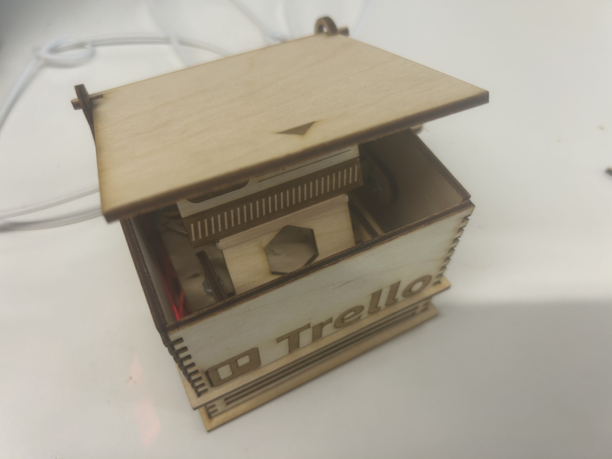

# 📦 Jack in the Box - Kinetic Trello Aura




**Kinetic Trello Aura** is a mechanical evolution of digital task management. It translates abstract Trello backlog pressure into a multi-sensory physical manifestation.
<br clear="left"/>

## 💡 Idea

As a mechanical evolution of the [Ambient Trello Aura](https://github.com/XXXStars0/Project-LED-Light), this project reimagines the classic "Jack in the Box" toy as a dynamic workspace companion. Supporting both **RedRover** (Cornell IoT) and custom Wi-Fi for versatile standalone connectivity, it translates digital urgency into mechanical movement and ambient light—providing a tangible, real-time pulse of project health and progress.

## 📁 Project Structure

- `img/`: Circuit diagrams and design images (Legacy).
- `design/`: Design diagrams and documentation for the current project.
- `Jack/`: Arduino/C++ source code for the Pico W.
- `Processing_Connect/`: Legacy wired mode (deprecated, no longer supported).
- `tests/`: API verification and testing scripts (Python).

## 📖 Documentation
To keep this README concise, detailed instructions and specifications have been moved to the `docs/` folder:

- **[🎨 Design & Assembly](docs/design_and_assembly.md)**: Hardware components list, pin mapping, laser cutting configuration, and assembly instructions.
- **[💻 Software Setup & Usage](docs/software_setup.md)**: API credentials, firmware flashing, and operational guides (including LED states and Sleep Mode).
- **[🛠️ Troubleshooting & Fixes](docs/troubleshooting.md)**: Solutions for Wi-Fi connection problems, DXF scaling, laser cutting tolerances, and mechanical friction.

## ⭐ Quick Start

For a complete step-by-step setup overview, see **[Software Setup & Usage](docs/software_setup.md)**.
Here is the core workflow:

1. **Hardware & Design**: Assemble the Pico W, Servo, Potentiometer, and LED on a half-size breadboard. Print/Cut the enclosure using the `design/Jack_Design_Lazercut.svg` file. 
2. **Clone the Repository**:
   ```bash
   git clone https://github.com/XXXStars0/Project-Jack-in-a-Box.git
   cd Project-Jack-in-a-Box
   ```
3. **Configure API Keys**: Duplicate `Jack/keys_template.h`, rename it to `Jack/keys.h`, and securely inject your Wi-Fi SSID/Password and Trello API credentials.
4. **Flash Firmware**: Open `Jack/Jack.ino` using the Arduino IDE and upload it to the Pico W.
5. **Operation**: Let the device boot up and connect. Gently rotate the handle to flip through your Trello lists. The "Jack" will interact with you based on the task pressure level (staying hidden, vibrating, or popping out)!

## 📄 License & Acknowledgements

This project uses a multi-license structure:
- **Design Files (`design/Jack_Design_Lazercut.svg`)**: Distributed under the **GPLv3 License** (see [`design/LICENSE`](design/LICENSE)). The box structure is an adaptation of the [PirateChest](https://boxes.hackerspace-bamberg.de/PirateChest) project from Hackerspace Bamberg.
- **Documentation (`docs/`, `README.md`)**: Distributed under the **CC BY-SA 4.0 License**.
- **Source Code & Remaining Files**: Distributed under the **MIT License** (see the [`LICENSE`](LICENSE) file for details).
