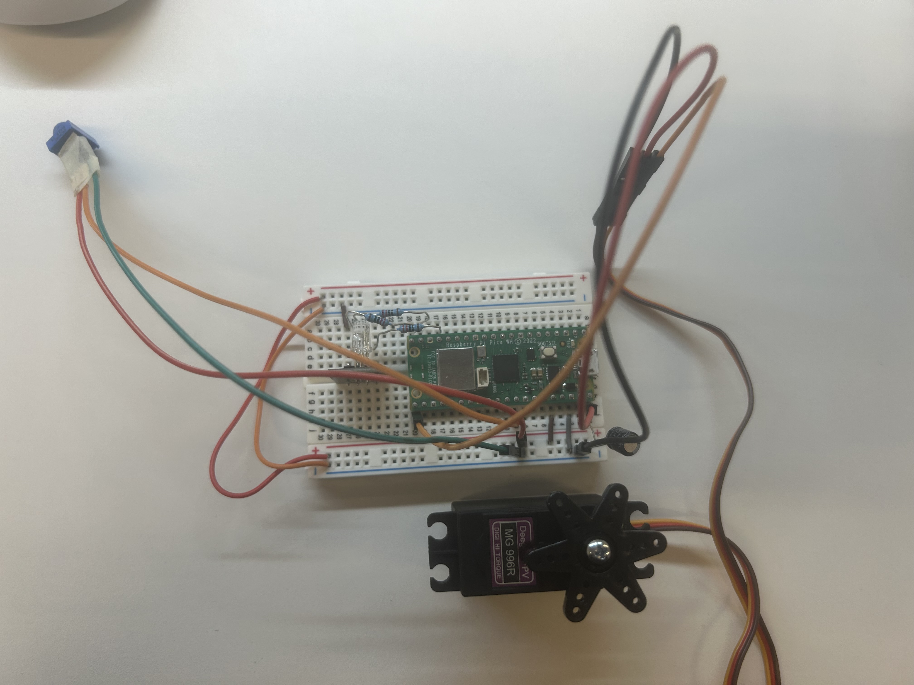
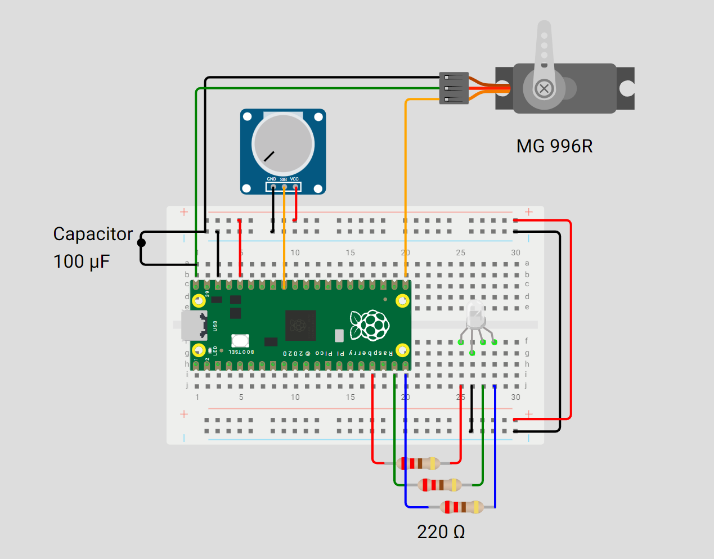

# 📦 Jack in the Box - Kinetic Trello Aura


**Kinetic Trello Aura** is a mechanical evolution of digital task management. It translates abstract Trello backlog pressure into a multi-sensory physical manifestation.
<br clear="left"/>

## 💡 Idea

As a mechanical evolution of the [Ambient Trello Aura](https://github.com/XXXStars0/Project-LED-Light), this project reimagines the classic "Jack in the Box" toy as a dynamic workspace companion. Supporting both **RedRover** (Cornell IoT) and custom Wi-Fi for versatile standalone connectivity, it translates digital urgency into mechanical movement and ambient light—providing a tangible, real-time pulse of project health and progress.

## 📁 Project Structure

- `img/`: Circuit diagrams and design images (Legacy).
- `design/`: Design diagrams and documentation for the current project.
- `Jack/`: Arduino/C++ source code for the Pico W.
- `Processing_Connect/`: Legacy wired mode (deprecated, no longer supported).
- `tests/`: API verification and testing scripts (Python).

## ⚙️ Hardware Components

- Raspberry Pi Pico W
- RGB LED (Common Cathode)
- Potentiometer (Model: **3386W-1-103**, 10kΩ, with top-knob) 
- MG 996R Servo (GP16 control, VBUS power)
- 100µF Capacitor (between VBUS and GND)
- 3× 220Ω Resistors (for RGB LED current limiting)
- Half-size Breadboard (Note: Full-size will not fit in the enclosure)
- Jumper wires

## 🎨 Design

### Prototypes & Schematic

*Current breadboard assembly for component testing and logic verification.*


*Wokwi circuit simulation for digital twin development.*

### Laser Cutting Configuration
The enclosure design files are published in **SVG** format. The following settings are calibrated for the **Epilog Fusion Pro 36**:

| Color (RGB)            | Mode         | Settings (S/P/F) | Recommended Use                |
| :--------------------- | :----------- | :--------------- | :----------------------------- |
| **Grey** (128,128,128) | Engrave      | 80 / 100 / --    | Decorative patterns / Text     |
| **Blue** (0,0,255)     | Vector Score | 50 / 25 / 10     | Fold lines / Layout guidelines |
| **Green** (0,255,0)    | Vector Cut   | 25 / 100 / 10    | Outer profile / Hole cutting   |
| **Red** (255,0,0)      | Vector Cut   | 25 / 100 / 10    | Final outer perimeter          |
| **Cyan** (0,255,255)   | Ignore       | --               | Labeling / Annotations         |
| **Black** (0,0,0)      | Ignore / Cut | --               | 30cm x 30cm Bounding Frame     |

**Recommended Operation Sequence:**
1. **Engrave** (Grey) → 2. **Vector Score** (Blue) → 3. **Vector Cut** (Green) → 4. **Vector Cut** (Red)

> [!NOTE]
> The project is currently under active development. The **Laser Cutting** enclosure design files and final assembly documentation are currently being finalized.

### 🛠️ Manufacturing & Assembly

#### Design Files
- [Jack_Design_Lazercut.svg](design/Jack_Design_Lazercut.svg): Full laser cutting layout including enclosure and internal mechanisms.

#### Additional Hardware (Non-wood parts)
| Item                        | Specification              | Quantity |
| :-------------------------- | :------------------------- | :------- |
| **Phillips Pan Head Screw** | #4-40 x 3/8", Carbon Steel | 15 + 2   |
| **Hex Nut**                 | #4-40, Carbon Steel        | 15 + 2   |
| **Rubber Band (Optional)**  | Standard                   | 1        |

> [!TIP]
> **Customization**: The 2 extra sets of screws/nuts are provided so you can mount custom stickers or notes onto the pop-up "Jack" card.

#### Assembly Tips & Notes
- **Side Parts**: The parts labeled "Side" are interchangeable. Their orientation depends on your preferred wiring path and which side you want the handle (potentiometer) to be on.
- **Potentiometer Stability**: Due to varying laser kerf, the square cutout for the potentiometer might not be perfectly snug. If it feels loose, wrap a small piece of paper or tape around the component before mounting.
- **Tensioning**: Using a rubber band to connect the signature card and the internal partition can improve the "pop" effect. However, be careful not to overtension, as it may cause servo displacement. Consider using an additional strap or rubber band anchored to the partition for better stability.
- **Mounting**: While the design aims for a glue-less assembly, adhesive-backing the breadboard to the bottom of the box is highly recommended for the best experience.

> [!NOTE]
> - **Assembly Manual**: Currently under development.
> - **Mechanical Optimization**: Improved limit screw designs (Medium priority) and screw-based board mounting (Low priority) are currently being finalized.

## 💡 Pin Mapping Reference

| Component           | Pico W Pin                   | Note         |
| ------------------- | ---------------------------- | ------------ |
| **RGB LED**         | GP13 (R), GP14 (G), GP15 (B) | PWM Support  |
| **Potentiometer**   | GP27                         | Analog Input |
| **Servo (MG 996R)** | GP16                         | PWM Control  |

## 📡 API Integration

This project uses the **[Trello API](https://developer.atlassian.com/cloud/trello/guides/rest-api/api-introduction/)** to monitor project changes and provide visual feedback via the RGB LED.

## 💻 Development Environment

- **Primary IDE**: Arduino IDE (for Pico W Sketch)
- **Secondary IDE**: VS Code (for documentation and API testing)
- **Platform**: Raspberry Pi Pico W 

## ⭐ Getting Started

### 1. Clone the Repository
```bash
git clone https://github.com/XXXStars0/Project-Jack-in-a-Box.git
cd Project-Jack-in-a-Box
```

### 2. Hardware Assembly
Assemble the components on a breadboard according to the **[Pin Mapping & Circuit Diagram](#-pin-mapping-reference)** above. Ensure the 220Ω current-limiting resistors are correctly placed for the RGB LED.

### 3. Flash the Firmware
1. Install the **Raspberry Pi Pico/RP2040** board support in the [Arduino IDE](https://www.arduino.cc/en/software/).
2. Open `Jack/Jack.ino`.
3. Select the correct board (**Raspberry Pi Pico W**) and COM port.
4. Upload the sketch to the Pico W.

> The firmware operates in Wi-Fi mode only. Wired (USB/Processing) mode has been deprecated.

### 4. Create API Credentials
Open `Jack/keys.h` (you can copy and rename the provided `Jack/keys_template.h` reference file) and fill in Wi-Fi credentials and Trello API keys.

### 5. Wi-Fi Mode Configuration
The Pico W connects to the internet directly and handles all API requests on-device.

1. **Cornell University (RedRover) Support:** Since the Pico W does not natively support WPA2 Enterprise (eduroam), it is adapted for **RedRover**.
   - Go to [it.cornell.edu/wifi](https://it.cornell.edu/wifi).
   - Select **"Register an IoT Device on RedRover"**.
   - Register the **Device MAC Address** of your Pico W (printed in the Serial Monitor during startup).
   - In `Jack/keys.h`, set the SSID to `"RedRover"` and leave the password empty:
     ```cpp
     #define SECRET_SSID "RedRover"
     #define SECRET_PASS ""
     ```
2. Re-upload the sketch.

### API Testing (Optional)
<details>
<summary>Click to expand Python API testing instructions</summary>

To verify Trello API connectivity independently using the provided Python script in `tests/`:

1. Install dependencies:
   ```bash
   pip install python-dotenv requests
   ```
2. Run the test script:
   ```bash
   python tests/trello_api_test.py
   ```

**💡 Note:** In line 29 of `trello_api_test.py` (`selected_list = trello_lists[0]`), the tracked list can be changed by modifying the index.

**Example Output:**
```text
---> Simulating potentiometer input: Currently tracking list 'To Do'

There are 1 cards in this list. Starting pressure value calculation...

   Card: Test 1
    Status: No due date -> Pressure +1

========================================
Total pressure score for the current list: 1
Pico W Pin PWM Output Instructions:
   -> GP13 (Red):   5
   -> GP14 (Green): 249
   -> GP15 (Blue):  0
```
</details>

## 🧰 Usage Instructions & Setup Flow

1. **Clone the Project**:
   ```bash
   git clone https://github.com/XXXStars0/Project-Jack-in-a-Box
   ```
   Get all design files (SVG), assembly tips, and source code.

2. **Assemble Hardware**: Follow the [Hardware Components](#-hardware-components) list. Ensure use of a **half-size breadboard** for the enclosure.

3. **Configure Keys**:
   - Reference `Jack/keys_template.h`.
   - Create a local `Jack/keys.h` and fill in your WiFi SSID, Password, and Trello API credentials.

4. **Flash Firmware**: Open `Jack/Jack.ino` in the Arduino IDE and upload it to the Pico W.

5. **Verify Connection**:
   Open the **Serial Monitor** at **9600 baud**. A successful connection and run will output:
   ```text
   Time synchronized!
   Fetching board Lists...
     [0] To Do
     [1] Doing
     [2] Done
     [3] List 4
     Found 4 lists.

   ========================================
   ---> Tracking list: 'Done'
    There are 0 cards in this list.
   Total pressure: 0
   Pressure Ratio: 0.00
   Target Servo State: IDLE (Blue/Green)
   ```

### 🎮 Operation
- **Switching Lists**: Gently rotate the handle to change tracked lists and trigger a refresh.
- **Vibration (Shake)**: Triggered during **Medium Pressure** (Yellow status).
- **Pop-out**: The lid will pop open when pressure reaches the **Red** threshold.
- **Reset**: The Jack will automatically retract and the lid will close when pressure returns to **Idle/Low**.

### Visual Status Indicators (LED)
The Pico W uses dual-core architecture for non-blocking LED animations (Core 1) during API requests (Core 0):
- ⚪ **BOOTING / LOADING:** Breathing effect. Startup or fetching new data.
- 🔴 **ERROR:** Rapid red double-blink. Wi-Fi disconnection or API failure.
- **TRACKING:** Solid color based on accumulated "Pressure Score" (card due dates):
  - 🔵 **Blue:** Idle / Empty list.
  - 🟢 **Green:** Low pressure.
  - 🟡 **Yellow:** Medium pressure.
  - 🔴 **Red:** High pressure (urgent/overdue).

## 🛠️ Troubleshooting & Fixes

### Eduroam Connection Failure
- **Issue:** Attempted to support `eduroam` (WPA2 Enterprise) directly, but the Pico W's `WiFi.h` library (arduino-pico) does not natively support the EAP authentication required for university networks.
- **Fix:** Switched to the **RedRover** IoT registration method. By registering the device's MAC address with Cornell IT, the Pico W can connect to the internet without additional enterprise headers. WiFi connection is now stable.
- **Note:** Ensure `Jack/keys.h` is correctly updated with `SECRET_SSID "RedRover"` and an empty `SECRET_PASS ""` to avoid authentication errors.

### Wired Mode Deprecated
- **Note:** The USB/Processing wired mode has been removed from the firmware. The project now operates exclusively via Wi-Fi. Legacy Processing files remain in the repository for reference only.

### Design File Scaling Issues (Fusion 360 to Illustrator)
- **Issue:** DXF files exported from Fusion 360 often import into Adobe Illustrator with broken scales, leading to incorrect physical dimensions during laser cutting.
- **Fix:** When importing DXF into Illustrator, ensure the scaling options are set explicitly (e.g., **1 Unit = 1 mm**). Using Adobe Illustrator for the final SVG export allows for superior color-coding (RGB mapping) and labeling required for laser cutter software.

### Mechanical Friction & Reset Issues
- **Issue:** The mechanism uses a cam to lift a wooden lever (the "Jack" card) which then pushes the lid open. High friction in the wooden laser-cut pivots can prevent the cam from returning reliably to the closed position, making the reset less smooth than the original LEGO prototype.
- **Workarounds:**
  - **Tensioning:** Attach a rubber band between the Jack card and the internal partition to force a return. 
  - **Servo Stability:** High tension from rubber bands may shift the servo; use an additional strap or rubber band to anchor the servo body more firmly to the partition.
  - **Polishing:** Lightly sand or polish the wooden axles and pivoting points to reduce surface friction.
  - **Future Fix:** A direct screw-mount for the servo is under consideration but remains low priority due to manufacturing complexity.

### Potentiometer Fit & Tolerances
- **Issue:** The square cutout for the potentiometer body and the circular hole for the knob rely on tight laser-cutting tolerances. Real-world kerf can result in a loose or overly tight fit compared to the theoretical CAD model.
- **Fixes:**
  - **Looseness:** If the square cutout is too large, wrap a thin strip of paper or tape around the potentiometer body to create a snug friction fit.
  - **Tightness:** If the hole is too small, it is recommended to re-cut the part with adjusted kerf compensation.
- **Current Prototype Status:** The example box shown in this project features a slightly loose square cutout (fixed with thing paper strips) and a perfectly fitting circular knob hole.
